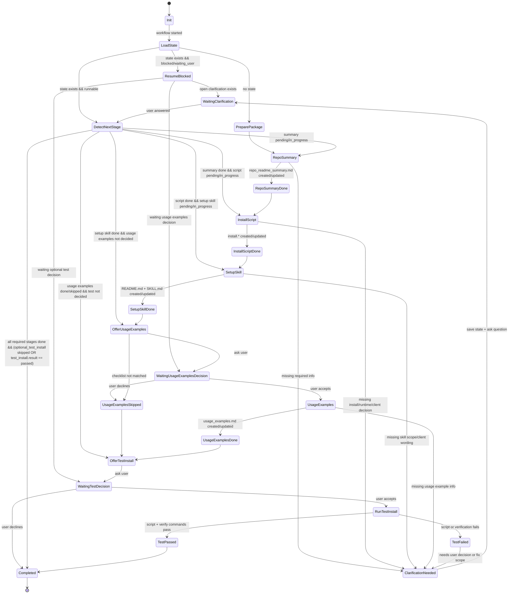

# open_supports Workflow Skill Plan

> 本计划记录 `open_supports/` 工作流 Skill 的最小设计。目标是把核心阶段 Skill 和可选阶段串成完整流程，并支持问题澄清、断点续传、可选用法示例和可选安装验证。

## Goal

新增一个 workflow Skill，按顺序编排：

1. `ost-repo-readme-summary`
2. `ost-install-script`
3. `ost-skill-for-setup`
4. `optional_usage_examples`
5. `optional_test_install`

前三个阶段负责生成核心支持包文件；第四阶段只在 checklist 命中且用户同意时生成 `usage_examples.md`。用户拒绝或条件不足时跳过，不影响核心支持包完成。第五阶段在用户明确同意后测试运行安装脚本并验证安装是否成功；用户拒绝测试时记录 skipped 决策，然后由 `complete` 统一验证完成。

## Scope

包含：

- 工作流状态机
- `.ost-workflow-state/` 状态目录约定
- 三个核心阶段 Skill 和可选 `ost-usage-examples` Skill 的统一澄清协议
- 可选 usage examples 阶段确认门
- 可选测试安装确认门

不包含：

- 默认执行安装脚本或写入用户本机配置

## State Directory

状态文件存放在：

```text
open_supports/.ost-workflow-state/
```

每个目标仓库一个状态文件：

```text
open_supports/.ost-workflow-state/{GithubName}_{RepoName}.json
```

示例：

```text
open_supports/.ost-workflow-state/colbymchenry_codegraph.json
```

状态 JSON 默认不提交 Git：

```gitignore
open_supports/.ost-workflow-state/*.json
!open_supports/.ost-workflow-state/README.md
```

## Minimal State Shape

```json
{
  "owner_repo": "colbymchenry/codegraph",
  "package_dir": "ost_colbymchenry_codegraph",
  "workflow_status": "in_progress",
  "current_stage": "install_script",
  "stages": {
    "repo_readme_summary": "done",
    "install_script": "in_progress",
    "skill_for_setup": "pending",
    "optional_usage_examples": "pending",
    "optional_test_install": "pending"
  },
  "clarifications": [],
  "usage_examples": {
    "offered": false,
    "decision": "pending",
    "matched_criteria": [],
    "result": null
  },
  "test_install": {
    "offered": false,
    "decision": "pending",
    "last_command": null,
    "failure": null,
    "result": null
  },
  "execution": {
    "mode": "subagent_preferred",
    "fallback": "inline",
    "current_agent_stage": null,
    "agent_runs": []
  },
  "updated_at": "2026-06-28T00:00:00Z"
}
```

阶段状态只使用：

```text
pending
in_progress
done
blocked
waiting_user
skipped
failed
```

## State Machine



## Clarification Protocol

三个核心阶段 Skill 和可选 `ost-usage-examples` Skill 需要遵循统一澄清协议：

```markdown
## Clarification / Blocking

如果执行本阶段所需信息无法从官方文档、repo_readme_summary.md、脚本或 .ost-refs/ 中可靠判断：

1. 不要猜测关键行为
2. 向 workflow 返回一个澄清问题
3. 标明 blocked 字段：
   - stage
   - reason
   - question
   - suggested_default（如有）
4. 等用户回答后再继续本阶段
```

workflow Skill 负责把该 blocked 信息写入状态文件，并在恢复时复述断点和待回答问题。

恢复时只处理当前唯一 open clarification，不维护多问题队列。

## Subagent Execution

三个核心产出阶段默认由阶段子代理串行执行：

1. `repo_readme_summary`
2. `install_script`
3. `skill_for_setup`

子代理只返回 `DONE`、`NEEDS_CLARIFICATION` 或 `FAILED` 的结构化结果。主 workflow 是唯一状态管理者和唯一用户交互者。

用户同意后，`optional_usage_examples` 也按阶段子代理串行执行。`optional_test_install` 由主 workflow 控制，不派发给阶段子代理。

主 workflow 使用内部状态脚本读写状态：

```text
open_supports/.copilot-skills/ost-support-workflow/scripts/state.sh
```

常用命令：

```sh
sh open_supports/.copilot-skills/ost-support-workflow/scripts/state.sh init OWNER/REPO
sh open_supports/.copilot-skills/ost-support-workflow/scripts/state.sh show OWNER/REPO
sh open_supports/.copilot-skills/ost-support-workflow/scripts/state.sh set-stage OWNER/REPO STAGE STATUS
sh open_supports/.copilot-skills/ost-support-workflow/scripts/state.sh block OWNER/REPO STAGE REASON QUESTION [SUGGESTED_DEFAULT]
sh open_supports/.copilot-skills/ost-support-workflow/scripts/state.sh answer OWNER/REPO ANSWER
sh open_supports/.copilot-skills/ost-support-workflow/scripts/state.sh agent-run OWNER/REPO STAGE STATUS SUMMARY
sh open_supports/.copilot-skills/ost-support-workflow/scripts/state.sh offer-usage-examples OWNER/REPO MATCHED_CRITERIA
sh open_supports/.copilot-skills/ost-support-workflow/scripts/state.sh usage-examples OWNER/REPO DECISION MATCHED_CRITERIA [RESULT]
sh open_supports/.copilot-skills/ost-support-workflow/scripts/state.sh test-result OWNER/REPO RESULT COMMAND EXIT_CODE SUMMARY
sh open_supports/.copilot-skills/ost-support-workflow/scripts/state.sh complete OWNER/REPO
```

阶段子代理不能直接调用状态脚本，避免并发写入和状态污染。

## Package Preparation

workflow Skill 可以在目标支持包不存在时自动创建最小目录结构：

```text
ost_{GithubName}_{RepoName}/
ost_{GithubName}_{RepoName}/scripts_for_install/
ost_{GithubName}_{RepoName}/skill_for_setup/
ost_{GithubName}_{RepoName}/skill_for_setup/ost_{GithubName}_{RepoName}_install/
```

可以创建缺失目录，但不要自动覆盖已有文件。目标产物文件已存在时，进入对应阶段的更新或确认逻辑。

## Optional Usage Examples

`skill_for_setup` 完成后，workflow Skill 先按 checklist 判断是否建议生成 `usage_examples.md`。命中 2 项以上时先用 `offer-usage-examples OWNER/REPO MATCHED_CRITERIA` 持久化等待决策状态，再询问用户；只有用户同意才执行 `optional_usage_examples` 阶段。用户拒绝或条件不足时，将 `optional_usage_examples` 标记为 `skipped`，记录 usage examples 决策，然后继续进入 `optional_test_install`。

Checklist：

- 官方文档包含 CLI 或可执行命令示例
- 官方文档包含项目初始化流程
- 支持包涉及配置文件或本地状态目录
- 支持包涉及 Agent、MCP、IDE、Copilot、Claude 或 Codex 接入
- 安装后存在常见工作流或后续操作
- 官方文档提供多个用法场景
- `.ost-refs/` 中存在本地约定、项目约定或推荐实践

命中 2 项或以上时，workflow Skill 先调用 `state.sh offer-usage-examples OWNER/REPO MATCHED_CRITERIA`，将 `usage_examples.offered = true`、`usage_examples.decision = pending`、`usage_examples.result = pending`、`optional_usage_examples = waiting_user`、`workflow_status = blocked` 写入状态，再询问用户。传给 `state.sh offer-usage-examples` 和 `state.sh usage-examples OWNER/REPO DECISION MATCHED_CRITERIA [RESULT]` 的 `MATCHED_CRITERIA` 是单个摘要字串；`state.sh` 会把它保存为 `usage_examples.matched_criteria` 的单元素数组。它不是 shell 解析的多值列表。

Decision/result matrix：

| Decision | Offered | Default result | Stage status | Notes |
| --- | --- | --- | --- | --- |
| `not_applicable` | `false` | `skipped` | `skipped` | checklist 命中不足，`matched_criteria` 保存为 `[]` |
| `declined` | `true` | `skipped` | `skipped` | 用户拒绝生成 usage examples |
| `accepted` | `true` | `pending` | `in_progress` | 用户同意后派发阶段子代理；产物审查后记录 `result: generated` 并将阶段标记为 `done` |

`RESULT` 省略时，`accepted` 默认 `result: pending`；`declined` 和 `not_applicable` 默认 `result: skipped`。

命中 2 项或以上时，workflow Skill 询问：

```text
检测到该支持包适合生成 usage_examples.md。是否要派发 ost-usage-examples 阶段子代理生成安装后的用法示例？
命中原因：
- CLI, Agent integration
这不影响核心支持包完成。
回复“是”则生成，回复“否”则跳过并继续 optional_test_install。
```

用户同意时：

- 将 `optional_usage_examples` 标记为 `in_progress`
- 记录 `usage_examples.offered` 为 `true`
- 记录 `usage_examples.decision` 为 `accepted`
- 记录命中的 `usage_examples.matched_criteria`
- 初始记录 `usage_examples.result` 为 `pending`
- 将 `workflow_status` 从 `blocked` 恢复为 `in_progress`
- 派发 `ost-usage-examples` 阶段子代理生成或更新 `usage_examples.md`
- 完成后记录 `usage_examples.result` 为 `generated`，并将 `optional_usage_examples` 标记为 `done`

用户拒绝或 checklist 命中不足时：

- 将 `optional_usage_examples` 标记为 `skipped`
- 用户拒绝时记录 `usage_examples.decision` 为 `declined`
- 条件不足时记录 `usage_examples.decision` 为 `not_applicable`，并将 `usage_examples.offered` 记录为 `false`、`usage_examples.matched_criteria` 记录为 `[]`
- 将 `usage_examples.result` 记录为 `skipped`
- 继续进入 `optional_test_install`

## Optional Test Install

三个核心产出阶段完成，且 `optional_usage_examples` 完成或跳过后，workflow Skill 必须询问：

```text
是否要测试运行 scripts_for_install/install.* 并验证安装是否成功？
这可能会修改本机 CLI / Agent 配置。回复“是”则执行，回复“否”则跳过并完成工作流。
```

用户同意时：

- 将 `optional_test_install` 标记为 `in_progress`
- 记录 `test_install.offered` 为 `true`
- 记录 `test_install.decision` 为 `accepted`
- 运行安装脚本
- 运行验证命令
- 记录 `test_install.last_command`、`test_install.result`，失败时记录 `test_install.failure`

验证命令优先来自 `repo_readme_summary.md` 第 2 部分，其次来自安装脚本或 setup Skill；仍不能判断时进入澄清。

用户拒绝时：

- 将 `optional_test_install` 标记为 `skipped`
- 记录 `test_install.offered` 为 `true`
- 记录 `test_install.decision` 为 `declined`
- 记录 `test_install.result` 为 `skipped`
- 使用 `test-result OWNER/REPO skipped ...` 记录拒绝测试；`workflow_status` 保持 `in_progress`
- 调用 `complete OWNER/REPO` 统一验证并完成

测试安装失败后不要自动修复。保存失败命令、退出码和关键输出摘要，将 `optional_test_install` 标记为 `failed`，将 `workflow_status` 标记为 `blocked`，然后询问用户下一步：修复支持包文件、跳过测试并完成，或停在失败状态稍后恢复。

## Completion

workflow 只能通过 `complete OWNER/REPO` 完成。该命令会验证三个核心产出阶段为 `done`、`optional_usage_examples` 为 `done` 或 `skipped`，且满足以下任一条件：

- `optional_test_install` 为 `skipped`
- `optional_test_install` 为 `done` 且 `test_install.result == passed`

测试安装失败时保持 `workflow_status` 为 `blocked`，直到用户选择修复、跳过测试完成，或稍后恢复。

## Implementation Tasks

- [x] 新增 workflow Skill 目录，例如 `.copilot-skills/ost-support-workflow/`
- [x] 在 workflow Skill 中记录状态文件路径、状态字段和恢复流程
- [x] 给 `ost-repo-readme-summary` 增加 `Clarification / Blocking` 协议
- [x] 给 `ost-install-script` 增加 `Clarification / Blocking` 协议
- [x] 给 `ost-skill-for-setup` 增加 `Clarification / Blocking` 协议
- [x] 新增 `.copilot-skills/ost-usage-examples/SKILL.md`
- [x] 在 workflow Skill 中增加 `optional_usage_examples` 阶段
- [x] 在 workflow Skill 中实现 `optional_test_install` 的用户确认门
- [x] 更新 workflow plan，使状态机包含可选 usage examples 阶段
- [x] 更新 `README-todo.md`，登记 workflow Skill 和状态机制
- [x] 统一模板摘要文件名为 `repo_readme_summary.md`
- [x] 增加 `sh + jq` 状态脚本 `state.sh`
- [x] 增加状态脚本测试 `test-state.sh`
- [x] 将串行子代理执行和上下文节省规则写入 workflow Skill
