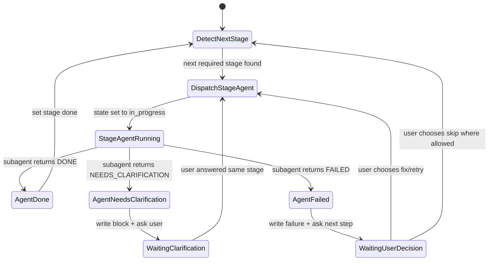

# open_supports Workflow Subagent Design

> 本文档记录 workflow Skill 引入子代理执行、状态脚本、问题澄清与上下文节省策略的设计结论。

## 目标

在 `open_supports/` 支持包工作流中，引入子代理执行三个重上下文阶段，以降低主 workflow 的上下文压力，同时保持问题澄清、状态恢复和可选安装验证的可控性。

## 结论摘要

- 三个产出阶段默认使用子代理执行，但必须串行执行。
- 主 workflow 是唯一状态管理者和唯一用户交互者。
- 阶段子代理只负责单阶段产出或返回结构化阻塞信息。
- 子代理不得把大段官方文档、完整中间过程或完整产物内容回灌给主 workflow。
- 问题澄清不引入专用澄清子代理，先由主 workflow 直接完成。
- 状态读写建议使用 `sh + jq` 的小脚本实现。
- 状态机只做小幅扩展，不新增复杂阶段状态枚举。

## 子代理执行策略

三个产出阶段适合使用子代理：

1. `repo_readme_summary`
2. `install_script`
3. `skill_for_setup`

这些阶段都需要读取官方 README、官方文档、阶段 Skill、目标支持包目录和可选 `.ost-refs/`，上下文较重。将它们交给独立子代理可以让主 workflow 保持轻量。

这些阶段不能并行执行，因为存在严格依赖：

- `repo_readme_summary` 是 `install_script` 的输入
- `install_script` 是 `skill_for_setup` 的输入
- `skill_for_setup` 完成后才进入可选测试安装验证

因此推荐策略是：**串行派发，一个阶段一个子代理**。

## 主 workflow 职责

主 workflow 保留以下职责：

- 读取 `open_supports/README-todo.md` 和 workflow 设计文档
- 初始化或读取 `.ost-workflow-state/*.json`
- 创建缺失的最小支持包目录结构
- 串行派发阶段子代理
- 接收子代理结构化结果
- 写入或更新状态文件
- 将子代理的问题澄清转述给用户
- 接收用户回答并恢复同一阶段
- 审查阶段产物是否存在
- 询问是否执行可选安装验证
- 在用户同意后执行安装验证或记录跳过

主 workflow 不应承担：

- 读取大段官方文档并长期保存在上下文中
- 复制阶段子代理的详细推理
- 直接维护复杂 JSON 编辑逻辑
- 让多个子代理同时写状态文件

## 阶段子代理职责

阶段子代理只执行一个阶段，并遵循对应阶段 Skill：

- `ost-repo-readme-summary`
- `ost-install-script`
- `ost-skill-for-setup`

阶段子代理允许读取：

- 当前阶段 Skill
- 官方 README / 官方文档
- 目标支持包文件
- `.ost-refs/` 中的补充说明
- 上一阶段产物
- 主 workflow 提供的用户澄清答案

阶段子代理必须返回结构化结果，不直接询问用户，不直接写 workflow 状态。

## 子代理返回格式

阶段子代理只返回编排所需的最小关键信息。

成功：

```json
{
  "status": "DONE",
  "stage": "install_script",
  "summary": [
    "Created POSIX sh install script.",
    "Uses official curl installer and local configuration by default."
  ],
  "files_changed": [
    "open_supports/ost_owner_repo/scripts_for_install/install.sh"
  ],
  "verification": [
    "sh -n scripts_for_install/install.sh: passed"
  ]
}
```

需要澄清：

```json
{
  "status": "NEEDS_CLARIFICATION",
  "stage": "install_script",
  "reason": "Official docs do not define default install scope.",
  "question": "安装脚本默认使用 local，只有用户显式指定时才使用 global，可以吗？",
  "suggested_default": "local"
}
```

失败：

```json
{
  "status": "FAILED",
  "stage": "install_script",
  "summary": [
    "Could not complete install script generation."
  ],
  "failure": {
    "command": "sh -n scripts_for_install/install.sh",
    "exit_code": 2,
    "output_summary": "Syntax error near unexpected token."
  }
}
```

## 上下文节省原则

主 workflow 必须尽可能保持上下文干净、节省。阶段子代理用于隔离重上下文，避免把官方 README、长文档、详细推理过程或完整中间草稿回灌给主 workflow。

阶段子代理不要返回：

- 大段官方文档摘录
- 完整 README 或完整安装文档
- 详细逐步推理过程
- 与当前阶段无关的发现
- 可从产物文件直接读取的完整内容

主 workflow 若需要审查产物，应读取目标文件本身，而不是要求子代理复制文件内容。状态文件只保存恢复和决策所需信息，不保存长文档或冗余中间过程。

## 问题澄清策略

不引入专用问题澄清子代理。

原因：

- 当前策略只支持当前唯一 open clarification，问题体积很小。
- 阶段子代理已经能发现问题并返回结构化澄清项。
- 主 workflow 只需转述一个短问题，不会显著消耗上下文。
- 引入澄清子代理会增加角色、状态和往返次数。
- 澄清子代理缺少完整阶段上下文，可能把问题改偏。

保留主 workflow 处理澄清：

1. 阶段子代理返回 `NEEDS_CLARIFICATION`
2. 主 workflow 写入状态文件
3. 主 workflow 向用户提出问题
4. 用户回答后，主 workflow 写入答案
5. 主 workflow 重新派发同一阶段子代理

未来只有在以下场景出现时，再考虑专用澄清子代理：

- 一个阶段经常产生多个复杂问题，需要合并、排序、去重
- 澄清问题需要转换成面向用户的选择题
- 用户回答很长，需要专门归纳成状态字段
- workflow 扩展到批量处理多个仓库

## 状态脚本策略

建议编写一个小型 `sh + jq` 状态脚本，用于机械读写 JSON 状态文件。

推荐位置：

```text
open_supports/.copilot-skills/ost-support-workflow/scripts/state.sh
```

脚本只负责状态文件操作，不负责 workflow 决策。

建议命令：

```text
init
show
set-stage
block
answer
agent-run
test-result
complete
```

示例：

```sh
sh open_supports/.copilot-skills/ost-support-workflow/scripts/state.sh init colbymchenry/codegraph
sh open_supports/.copilot-skills/ost-support-workflow/scripts/state.sh set-stage colbymchenry/codegraph install_script in_progress
sh open_supports/.copilot-skills/ost-support-workflow/scripts/state.sh block colbymchenry/codegraph install_script "reason" "question" "suggested default"
sh open_supports/.copilot-skills/ost-support-workflow/scripts/state.sh answer colbymchenry/codegraph "用户回答内容"
sh open_supports/.copilot-skills/ost-support-workflow/scripts/state.sh agent-run colbymchenry/codegraph install_script NEEDS_CLARIFICATION "summary"
sh open_supports/.copilot-skills/ost-support-workflow/scripts/state.sh test-result colbymchenry/codegraph failed "cmd" "exit 1" "summary"
sh open_supports/.copilot-skills/ost-support-workflow/scripts/state.sh complete colbymchenry/codegraph
```

脚本不做：

- 决定下一阶段
- 读取官方 README
- 派发子代理
- 执行安装脚本
- 自动修复失败
- 解释用户回答

这些仍由 workflow Skill 负责。

## jq 适配性

`jq` 足够满足当前状态管理需求：

- 读取字段
- 判断字段是否存在
- 设置阶段状态
- 追加澄清记录
- 写入用户回答
- 追加 agent run 记录
- 更新嵌套字段
- 生成合法 JSON
- 校验 JSON 语法

脚本实现要求：

- 启动时检测 `jq`
- 所有文本参数使用 `jq --arg`
- 不手拼 JSON 字符串
- 使用临时文件加原子替换写入状态

示例写入模式：

```sh
tmp="${state_file}.tmp.$$"
jq '...' "$state_file" > "$tmp"
mv "$tmp" "$state_file"
```

并发控制：

- 子代理不能直接调用状态脚本
- 只有主 workflow 能写状态
- 避免多个执行者同时修改同一 JSON 文件

## 状态结构扩展

保留现有阶段状态枚举：

```text
pending
in_progress
done
blocked
waiting_user
skipped
failed
```

不新增 `agent_running`。`in_progress` 可表示当前阶段正在由子代理执行。

建议增加 `execution` 字段：

```json
{
  "execution": {
    "mode": "subagent_preferred",
    "fallback": "inline",
    "current_agent_stage": "install_script",
    "agent_runs": [
      {
        "stage": "install_script",
        "status": "NEEDS_CLARIFICATION",
        "started_at": "2026-06-28T00:00:00Z",
        "ended_at": "2026-06-28T00:03:00Z",
        "summary": "Install target defaults could not be determined."
      }
    ]
  }
}
```

## 状态机更新

现有状态机不需要推翻，只需在三个产出阶段内引入子代理派发子流程。

每个阶段内部扩展为：

```text
StageReady
  -> DispatchStageAgent
  -> StageAgentRunning
  -> AgentDone
  -> AgentNeedsClarification
  -> AgentFailed
```

推荐状态流：



状态机边上的副作用使用状态脚本完成：

- `DispatchStageAgent` 前：`state.sh set-stage <stage> in_progress`
- `AgentDone` 后：`state.sh set-stage <stage> done`
- `AgentNeedsClarification` 后：`state.sh block ...`
- `WaitingClarification` 后：`state.sh answer ...`
- `AgentFailed` 后：`state.sh agent-run ... FAILED`

## 可选测试安装阶段

`optional_test_install` 不默认交给子代理。

原因：

- 会真实运行安装脚本
- 可能访问网络
- 可能写入本机 CLI 或 Agent 配置
- 可能触发权限问题
- 必须由主 workflow 保留用户授权边界

规则：

- 主 workflow 必须先询问用户
- 用户拒绝则标记 `skipped` 并完成
- 用户同意后主 workflow 执行或显式派发受限测试执行者
- 失败后不自动修复，保存失败状态并询问下一步

## 待审阅决策

以下决策已审阅并用于实现：

- 三个产出阶段默认串行子代理执行
- 主 workflow 是唯一状态管理者和唯一用户交互者
- 子代理只返回最小结构化结果
- 不引入专用问题澄清子代理
- 使用 `sh + jq` 编写状态脚本
- 状态脚本放在 workflow Skill 内部目录
- 状态枚举不增加，只扩展 `execution.agent_runs`
- 可选测试安装阶段默认由主 workflow 控制

## 实现记录

已落地文件：

- `open_supports/.copilot-skills/ost-support-workflow/SKILL.md`
- `open_supports/.copilot-skills/ost-support-workflow/scripts/state.sh`
- `open_supports/.copilot-skills/ost-support-workflow/scripts/test-state.sh`
- `open_supports/workflow-plan.md`

状态脚本测试：

```sh
sh open_supports/.copilot-skills/ost-support-workflow/scripts/test-state.sh
```
